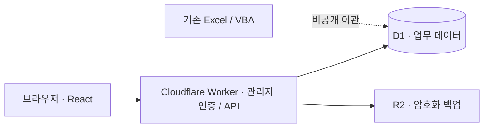

<p align="center">
  <a href="https://jipjangbu.minseop0920370667.chatgpt.site">
    
  </a>
</p>

<p align="center">
  <strong>실사용 피드백으로 개선하는 부동산 업무관리 웹앱.</strong><br />
  고객 · 매물 · 업무 기록을 연결하고, 검색 · 이력 조회 · 수정 · 복구까지 한곳에서.
</p>

<p align="center">
  <a href="https://github.com/seopseopi/Jipjangbu/actions/workflows/ci.yml"></a>
  
  
  
</p>

<p align="center">
  <a href="https://jipjangbu.minseop0920370667.chatgpt.site"><strong>집장부 열기 ↗</strong></a>
  &nbsp; · &nbsp; <a href="#화면으로-보는-집장부">화면 갤러리</a>
  &nbsp; · &nbsp; <a href="docs/case-study.md">기술 사례</a>
  &nbsp; · &nbsp; <a href="docs/usage.md">사용 안내</a>
  &nbsp; · &nbsp; <a href="#로컬-개발">로컬 실행</a>
</p>

<p align="center"><sub>운영 서비스는 관리자 전용입니다. 공개 체험 계정 대신, 합성 데이터로 검증한 화면과 구현 근거를 제공합니다.</sub></p>

## 프로젝트 소개

집장부는 엑셀 기반의 고객·매물·업무 기록을 웹에서 통합 관리하는 부동산 업무관리 서비스입니다. `업무일지(개발필요).xlsb`의 다섯 핵심 시트를 중심으로, 원본 통합문서의 VBA 동작과 추가 현황 시트까지 분석해 웹으로 옮겼습니다.

기존 기록의 관계를 이어가면서, 큰 글씨와 명확한 상태 표시, 자연스러운 화면 이동, 찾기 쉬운 검색·정렬에 집중했습니다.

| 관점 | 프로젝트에서 다룬 범위 |
| :--- | :--- |
| 사용자 | 엑셀에 익숙한 부동산 실무자 · PC·모바일 지원 |
| 제품 | 고객·매물·업무일지·달력·통합검색·휴지통 |
| 엔지니어링 | 엑셀 이관, 관계형 데이터 설계, API·화면 구현, 조회 최적화, 삭제·복구, 인증·백업 |
| 개선 방식 | 사용자 피드백 → 재현 → 원인 분석 → 구현 → 회귀 검사 |

## 화면으로 보는 집장부

아래는 **2026-09-13~14 개발·검증 당시의 실제 앱 캡처**입니다. 고객·매물·내용은 모두 합성 자료이며, 메뉴 구성 등 일부는 이후 운영 화면과 다를 수 있습니다. 이미지를 누르면 원본 크기로 볼 수 있습니다. 상단 커버는 화면 캡처가 아닌 브랜드 일러스트입니다.

### 01 · 눈에 보이는 주소로 찾기

`106동 1503호`처럼 화면에서 읽은 주소를 그대로 검색합니다. 한 업무에 여러 매물이 있어도 **실제로 일치한 매물**을 구분하고, 그 매물의 이력으로 연결합니다.

<a href="docs/assets/journal-search.png"></a>

<table>
  <tr>
    <td width="50%" valign="top">
      <strong>02 · 먼저 읽고, 필요할 때 수정</strong><br /><br />
      <a href="docs/assets/work-detail.png"></a><br />
      여러 물건을 함께 상담한 기록도 주소·가격·업소를 펼쳐 확인합니다. 읽기와 편집은 분리했습니다.
    </td>
    <td width="50%" valign="top">
      <strong>03 · 삭제하기 전에, 영향을 확인</strong><br /><br />
      <a href="docs/assets/safe-deletion.png"></a><br />
      저장된 내용과 연결 매물을 먼저 보여 줍니다. 실수한 기록은 휴지통으로 이동하고 필요하면 복구합니다.
    </td>
  </tr>
</table>

<details>
<summary><strong>04 · 휴대폰과 큰 글씨에서도 — 화면 펼치기</strong></summary>

<p align="center">
  <a href="docs/assets/mobile-trash.png"></a>
</p>

삭제한 업무의 내용과 연결 정보를 확인한 뒤 복구하는 흐름입니다. 이 캡처는 로컬 Worker·D1·R2에 합성 자료를 넣고 수행한 E2E에서 가져왔습니다.

</details>

[이미지 출처·공개 검수 기준](docs/assets/README.md) · [사용 흐름 검증](docs/workflow-review.md) · [삭제·복구 E2E](docs/deletion-e2e-review.md)

## 매일 필요한 일을 한곳에서

| 화면 | 할 수 있는 일 |
| :--- | :--- |
| **오늘의 업무** | 요약 카드에서 오늘 업무·7일 전체 일정 팝업 조회 · 오늘 업무는 최근 수정순 · 본문은 최근 업무와 챙겨야 할 일 |
| **업무일지** | 날짜·고객과 넓은 본문·연결 매물을 구분 · 같은 단지 이름의 반복을 줄이고 모든 동·호수 표시 · 내용 보기에서 가격·업소 비교 |
| **고객 관리** | 이름·전화번호로 찾고 전체 상담 이력 확인 · 고객 정보와 업무 등록·수정 |
| **매물 관리** | 건물·동·호수별 조회 · 엑셀처럼 이어 읽는 전체 매물 이력 · 개별 업무 펼쳐 보기 · 원본 메모와 기존 기록 보존 |
| **업무 현황** | 최근 6개월 업무량, 업무구분별 현황, 앞으로 30일 전체 일정과 확인이 필요한 매물 파악 |
| **업무 달력** | 엑셀의 업무 유형별 표시 기준 유지 · 같은 단지 묶음과 모든 물건 표시 · 휴대폰 날짜별 목록 |
| **휴지통** | 업무·고객·할 일 안전 삭제 · 삭제 내용 확인·검색·복구 · 매물 상태와 이력 함께 재계산 |
| **검색·설정** | 업무·고객·매물 통합검색, 화면별 CSV 내보내기, 분류 관리와 백업 다운로드 |

### 사용 흐름을 끊지 않도록

- **찾기 쉽게:** 통합검색의 고객·매물은 정확한 일치를 우선하고, 업무는 최신순·할 일은 기한순·매물 목록은 매물종류 → 이름 → 동·호수순으로 보여줍니다. 매물종류·이름 제목을 눌러 정렬과 역순을 바꿀 수 있습니다.
- **읽기 쉽게:** 기기별 큰 글씨와 명확한 상태 표시를 제공합니다. 업무일지는 본문 5줄 미리보기와 모든 매물 주소를 보여주고, **내용 보기**에서 원문·가격·업소를 확인한 뒤 필요한 경우에만 수정합니다.
- **다시 이어가기 쉽게:** 검색 조건을 유지하며 이동하고, 로고를 누르면 홈으로 돌아옵니다. 작성 중 닫기에는 확인 절차가 있습니다.
- **수정 중에도 이력을 곁에:** 업무 입력을 유지한 채 고객·매물 이력을 펼쳐 보고, 이력에서 수정·저장하면 원래 이력으로 돌아옵니다. 펼친 업무 목록도 유지합니다.
- **지금 상태를 정확하게:** 검색 대기·갱신·조회 실패·정상 0건을 구분합니다. 저장이 성공한 뒤 목록 조회만 실패한 경우에도 성공과 재시도할 작업을 따로 안내합니다.
- **기존 고객을 빠뜨리지 않게:** 업무 등록의 고객 선택은 1,000명 이후까지 전체 명부를 읽고, 최근 업무·등록순으로 추천합니다. 고객·매물 관리 목록은 최대 1,000건 표시와 CSV 범위를 안내합니다.
- **여러 기기에서도:** 같은 관리자 계정으로 동시에 로그인할 수 있습니다. 같은 기록의 동시 편집을 병합하거나 잠그지는 않으므로, 나중 저장이 앞선 변경을 덮을 수 있습니다.

## 숫자로 보는 현재 구현

| 검증·기능 | 값 | 의미 |
| :--- | ---: | :--- |
| 자동 테스트 | **416개 통과** | 실제 API/SQL와 화면 이벤트로 삭제·복구·삭제 시 변경 충돌·백업·탐색·검색·누적 매물 이력·엑셀 달력 규칙 등 회귀 검증 |
| 전체 백업 범위 | **9개 테이블** | 고객·업무·물건 상세·매물·변경 이력·업무구분·건물·할 일·휴지통 |
| 한 업무에 연결할 물건 | **최대 10개** | 여러 물건을 함께 상담한 업무를 하나의 기록으로 관리 |
| 자동 백업 보관 기간 | **90일** | 장기 보관이 필요한 파일은 별도로 내려받아 보관 |

테스트 수는 **2026-09-14 / [`907d299`](https://github.com/seopseopi/Jipjangbu/commit/907d299bc20a134e20f1dbe57f072fe684fa455e)** 기준입니다. [해당 CI 실행](https://github.com/seopseopi/Jipjangbu/actions/runs/34839226419)에서 확인할 수 있습니다. 테스트 수는 커버리지나 무결점 보증이 아니며, 운영 고객 수나 실제 업무 내용은 포트폴리오 성과로 공개하지 않습니다. 최신 상태는 상단 CI 배지에서 확인하세요.

[삭제 기능 PRD](docs/deletion-prd.md)와 [실제 삭제·복구 E2E 보고서](docs/deletion-e2e-review.md)에 안전장치, 검증 중 고친 문제, 추가 권장 사항을 정리했습니다.

[실제 업무 흐름 점검](docs/workflow-review.md)에는 문제의 원인·수정 범위, 합성 자료를 사용한 브라우저 검증, 운영 복원 미검증·동시 편집·초안 보관 등의 남는 한계를 함께 정리했습니다.

[가독성 개선 기록](docs/readability-review.md)에서는 묶음 업무의 반복 주소·버튼을 줄이면서 원순서와 모든 물건을 유지한 방법을 확인할 수 있습니다.

## 피드백을 설계로 바꾼 다섯 가지 사례

| 실제 문제 | 설계·구현의 선택 | 확인할 근거 |
| :--- | :--- | :--- |
| 보이는 동·호수로 검색했는데 0건 | 표시 주소와 저장 필드의 차이를 공통 검색 규칙으로 해소. 같은 물건 행에서 동·호 조건을 함께 비교 | [검색 점검](docs/search-review.md) |
| 기록을 눌렀더니 바로 수정창 | 읽기 우선으로 전환. 연결 매물 전체 표시, 이력 확인 후 원래 화면·초안으로 복귀 | [업무 흐름](docs/workflow-review.md) |
| 저장한 내용을 매물 이력에서 찾기 어려움 | 최신 저장 한 건 대신 업무일 기준의 누적 이력. 과거 정정과 새 변경 기록 구분 | [이력 개선](docs/readability-review.md) |
| 느린 조회 중 창이 열리지 않음 | 준비창 즉시 표시, 조회의 반복 취소 방지와 후속 최신 조회. 서버 초기화는 완료 상태만 공유 | [로딩 검증](docs/loading-e2e-review.md) |
| 삭제 후 연결 매물의 상태가 틀어질 위험 | 스냅샷·관계 제거·상태 재계산을 원자적으로 처리. 변경된 확인 대상은 삭제 거부 | [삭제 PRD](docs/deletion-prd.md) · [E2E](docs/deletion-e2e-review.md) |

**선택의 이유와 남는 한계까지:** [기술 사례 문서 읽기 →](docs/case-study.md)

### 기다리는 시간을 줄인 구조

| 개선한 경로 | 이전 | 현재 |
| :--- | :--- | :--- |
| 화면 전환·정렬·필터 | 조회 전 300ms 대기 | 즉시 조회; 검색 입력만 250ms 지연 |
| 홈 기본 HTTP 조회 · 할 일 패널 제외 | 3개 | **2개** · 고객명부는 입력창을 처음 쓸 때 조회 |
| 홈 데이터 조회 | DB 왕복 5회 | **batch 1회** |
| 분류 / 통합검색 DB 호출 | 2회 / 3회 | **각 batch 1회** |
| 검색어 없는 업무 요약의 상관 하위 조회 | 9개 | **3개** · 모든 물건 정보 포함 |
| 전체 백업 데이터 읽기 | 테이블별 순차 조회 | **9개 테이블 batch 1회** |
| 합성 고객명부 SQL 중앙값 | 28.91ms | **3.80ms** |

마지막 행은 **고객 4,000명·업무 160,000건의 로컬 SQLite** 측정입니다. 전체 고객의 업무를 먼저 집계하던 쿼리를, 반환할 페이지의 고객만 기존 인덱스로 집계하도록 변경했습니다. **운영 사이트 전체가 같은 비율로 빨라졌다는 뜻은 아닙니다.**

같은 조회의 동시 요청도 하나로 합치고, 화면 코드는 필요할 때 불러옵니다. 측정 방법과 합성 데이터 벤치마크는 [성능 개선 기록](docs/performance.md), 취소·재시작·최신성 검증은 [로딩 E2E](docs/loading-e2e-review.md)에서 확인하세요.

## 데이터가 저장되는 곳



| 영역 | 구성 |
| :--- | :--- |
| 화면 | React 19 · TypeScript · Tailwind CSS 4 · Lucide 아이콘 |
| 실행·빌드 | vinext · Vite · Cloudflare Workers |
| 데이터 | Cloudflare D1 / SQLite · Drizzle 스키마·마이그레이션 · prepared SQL / batch |
| 로그인 | 비밀번호 해시 검증 · 서명된 HttpOnly 세션 쿠키 · 로그인 시도 제한 |
| 백업 | Cloudflare R2 · AES-GCM 암호화 · 변경 전후 / 이용 시 일일 / 수동 백업 |
| 검증 | GitHub Actions · ESLint · TypeScript · Node.js 테스트 러너 |

### 코드에서 확인하기

| 관심사 | 시작할 파일 |
| :--- | :--- |
| 화면 전환·초안·모달 흐름 | [`app/work-manager.tsx`](app/work-manager.tsx) |
| 주소 검색과 정렬 | [`app/api/_search.js`](app/api/_search.js) · [`app/api/_ordering.ts`](app/api/_ordering.ts) |
| 관계형 모델과 매물 상태 갱신 | [`db/schema.ts`](db/schema.ts) · [`db/listing-sync.ts`](db/listing-sync.ts) |
| 읽기 캐시와 요청 수명 | [`app/client-api.ts`](app/client-api.ts) · [`db/bootstrap.ts`](db/bootstrap.ts) |
| 안전한 삭제·복구 | [`app/api/trash`](app/api/trash) · [`tests/deletion-safety.test.mjs`](tests/deletion-safety.test.mjs) |
| 인증·암호화 백업 | [`worker/security.ts`](worker/security.ts) · [`tests/runtime-performance.test.mjs`](tests/runtime-performance.test.mjs) |

### 공개 코드와 실제 업무 데이터는 분리합니다

- 이 저장소에는 앱 코드·스키마·예시 데이터만 둡니다. 실제 고객·업무·매물 자료, 비밀번호, 운영 키, 백업 파일은 커밋하지 않습니다.
- 사이트 주소는 공개되어 있어도 업무 화면과 API는 관리자 로그인이 필요합니다. 공개 체험 계정은 제공하지 않습니다.
- **변경 전 백업에 실패하면 데이터 변경을 중단합니다.** 변경 후 백업과 수동 백업도 지원합니다.
- 일일 백업은 **사이트를 이용할 때** 실행합니다. 접속이 없어도 정해진 시각에 실행되는 예약 작업은 아닙니다.
- 다운로드한 백업은 안전한 별도 장소에 보관하세요. CSV는 화면별 자료 내보내기이며, 관계까지 복구하는 전체 백업을 대신하지 않습니다.

할 일은 직접 등록한 내용만 저장하며, 문자·전화·푸시 알림을 자동 전송하지 않습니다. 상세 동작과 주의사항은 [사용 안내](docs/usage.md)에 정리했습니다.

### 검증 범위와 다음 단계

운영 DB 전체 복원·재해 복구 훈련은 수행하지 않았습니다. 일반 업무 수정은 마지막 저장이 앞선 변경을 덮을 수 있고, 초안은 새로고침 후 자동 복구되지 않습니다. 삭제·복구의 충돌 검증과 일반 수정의 동시 편집 보호는 구분해야 합니다.

다음 개선 후보는 **수정 전 버전 복원, 동시 편집 충돌 방지, 접속과 무관한 예약·외부 백업**입니다. 현재 완료된 기능과 구분해 관리합니다.

## 로컬 개발

**Node.js 24**와 npm을 권장합니다. 테스트는 `node:sqlite`와 `module.registerHooks`를 사용합니다.

```bash
git clone https://github.com/seopseopi/Jipjangbu.git
cd Jipjangbu
npm ci
```

[`.env.example`](.env.example)을 참고해 Git에서 제외되는 로컬 `.env`에 관리자 아이디, 비밀번호 해시, 세션 키, 백업 암호화 키를 설정하세요. 예시의 자리표시자는 실제 값이 아니며, 설정하지 않으면 로그인할 수 없습니다. 비밀번호 해시 형식은 [`worker/security.ts`](worker/security.ts)의 `verifyPassword`를 참고하세요. 개발용 키와 운영용 키는 분리합니다.

```bash
npm run dev
```

개발 서버가 출력하는 로컬 주소로 접속합니다. 로컬 개발은 별도의 D1·R2 에뮬레이터 저장소를 사용하며, 운영 데이터는 포함하지 않습니다. 로컬 실행·검사에 운영 비밀키나 실제 고객 자료는 필요하지 않습니다.

| 명령 | 역할 |
| :--- | :--- |
| `npm run dev` | 로컬 개발 서버 |
| `npm run lint` | 코드 규칙 검사 |
| `npm test` | 타입 검사 → 빌드 → 회귀 테스트 |
| `npm run build` | 배포용 빌드 |
| `npm run db:generate` | 스키마 변경 후 마이그레이션 생성 |

GitHub Actions는 `main`에 올리거나 PR을 만들 때 설치·코드 검사·타입 검사·빌드·테스트를 실행합니다. 운영 사이트를 자동 배포하거나 운영 DB를 변경하지 않습니다.

<details>
<summary>기존 엑셀 자료를 다시 이관하려면</summary>

Excel에서 개발필요 파일을 `.xlsx`로 복사 저장한 뒤 [`scripts/build_private_import.py`](scripts/build_private_import.py)로 비공개 마이그레이션을 만듭니다. 생성되는 `*_private_*.sql` 파일은 Git에서 제외됩니다. 원본 파일과 생성 결과를 공개 저장소에 넣지 마세요.

시트별 역할, 중복 처리와 원문 보존 기준은 [엑셀 분석·이관 규칙](docs/excel-analysis.md)을 먼저 확인하세요. 운영 자료를 다시 넣기 전에는 반드시 백업과 대상 환경을 확인해야 합니다.

</details>

---

<p align="center">
  <strong>기록은 차곡차곡, 업무는 한눈에.</strong><br />
  <sub>집장부 · <a href="docs/case-study.md">기술 사례</a> · <a href="docs/usage.md">사용 안내</a> · <a href="docs/assets/README.md">이미지 출처</a></sub>
</p>
