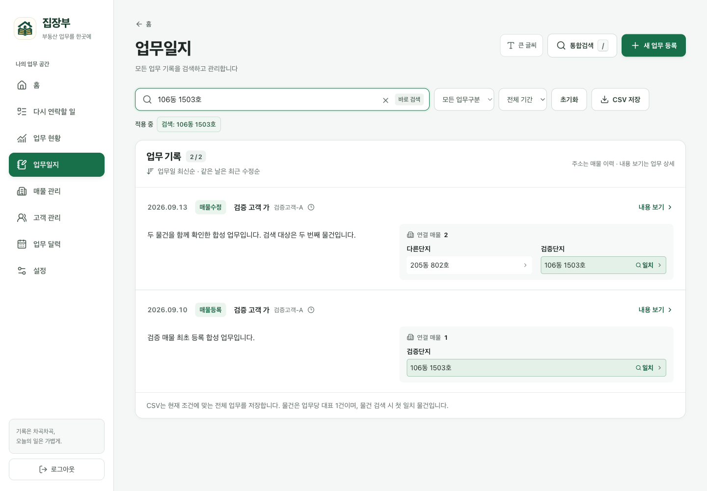
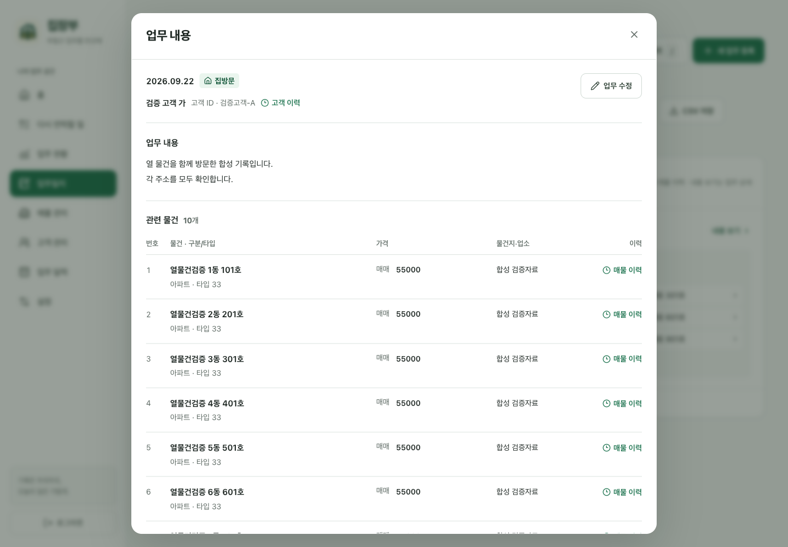
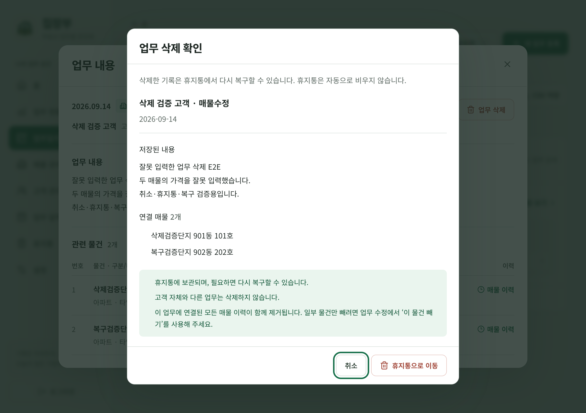
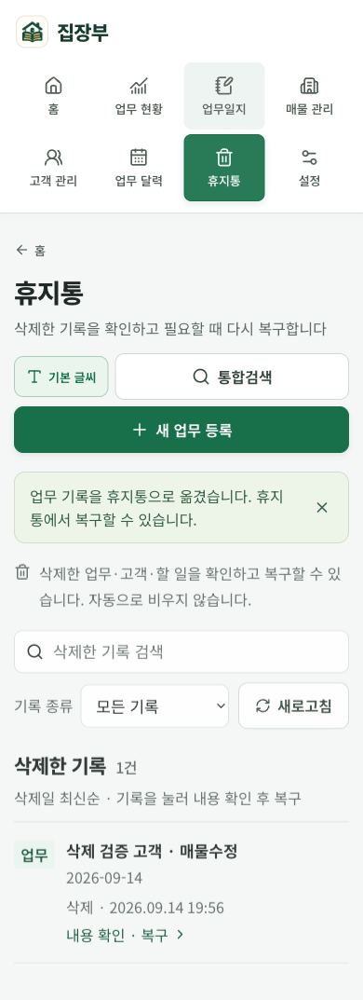

<p align="center">
  <a href="https://jipjangbu.minseop0920370667.chatgpt.site">
    
  </a>
</p>

<p align="center">
  <strong>부동산 업무의 기록부터 다음 일정까지.</strong><br />
  고객과 매물, 상담 이력과 일정을 연결하는 부동산 업무관리 서비스입니다.
</p>

<p align="center">
  <a href="https://jipjangbu.minseop0920370667.chatgpt.site"><strong>서비스 바로가기 ↗</strong></a>
  &nbsp; · &nbsp; <a href="docs/usage.md">사용 가이드</a>
  &nbsp; · &nbsp; <a href="docs/README.md">문서</a>
  &nbsp; · &nbsp; <a href="https://github.com/seopseopi/Jipjangbu/issues/new/choose">버그 제보 · 기능 제안</a>
</p>

<p align="center">
  <a href="https://github.com/seopseopi/Jipjangbu/actions/workflows/ci.yml"></a>
  
  
  
</p>

<p align="center"><sub>PC · 모바일 · 큰 글씨 지원 &nbsp; | &nbsp; 운영 서비스는 관리자 로그인 후 이용할 수 있습니다.</sub></p>

---

## 흩어진 기록을 하나의 업무 흐름으로

이름이나 주소로 기록을 찾고, 고객과 매물의 지난 이력을 확인한 뒤, 다음 업무를 이어서 작성합니다. 엑셀에서 이어온 기록도 웹에서 함께 관리합니다.

<table>
  <tr>
    <td width="50%" valign="top">
      <h3>고객과 매물을 함께</h3>
      고객명·ID, 매물 주소와 물건지를 한눈에 확인합니다. 한 업무에 여러 매물을 연결하고, 입력 중에도 지난 이력을 볼 수 있습니다.
    </td>
    <td width="50%" valign="top">
      <h3>오늘부터 다음 일정까지</h3>
      오늘 업무와 다가오는 일정을 요약 카드에서 확인합니다. 달력은 업무 유형에 맞춰 고객 또는 매물 중심으로 보여줍니다.
    </td>
  </tr>
  <tr>
    <td valign="top">
      <h3>검색한 자리에서 이어서</h3>
      건물명·동·호수, 고객명·연락처로 찾습니다. 기록을 먼저 읽고, 필요할 때 수정한 뒤 보던 이력으로 돌아옵니다.
    </td>
    <td valign="top">
      <h3>실수에 대비한 기록 관리</h3>
      삭제 전 내용과 연결 정보를 확인하고, 휴지통에서 복구합니다. 중요한 자료는 전체 암호화 백업으로 별도 보관할 수 있습니다.
    </td>
  </tr>
</table>

## 서비스 둘러보기

**보이는 주소로 검색하고, 일치한 매물을 바로 확인합니다.**

<a href="docs/assets/journal-search.png"></a>

<table>
  <tr>
    <td width="50%" valign="top">
      <a href="docs/assets/work-detail.png"></a>
      <p><strong>내용을 먼저 읽고, 필요할 때 수정</strong><br />긴 메모와 여러 매물을 펼쳐 보고 각 이력으로 이동합니다.</p>
    </td>
    <td width="50%" valign="top">
      <a href="docs/assets/safe-deletion.png"></a>
      <p><strong>삭제 전 확인, 실수했다면 복구</strong><br />삭제할 내용을 확인하고 휴지통으로 옮깁니다.</p>
    </td>
  </tr>
</table>

<details>
<summary>모바일 · 큰 글씨 화면 보기</summary>

<p align="center">
  <a href="docs/assets/mobile-trash.png"></a>
</p>

</details>

<sub>화면은 합성 데이터로 검증한 2026-09-13~14의 실제 앱 캡처이며, 이후 변경된 메뉴·배치와 다를 수 있습니다. 상단 배너는 브랜드 일러스트입니다. <a href="docs/assets/README.md">이미지 출처</a></sub>

## 주요 기능

| 화면 | 주요 기능 |
| :--- | :--- |
| **홈** | 최근 업무 · 오늘 업무와 7일 일정 팝업 · 메모를 포함한 할 일 관리 |
| **업무일지** | 고객·주소·내용 검색 · 기간·업무구분 필터 · 여러 매물 연결 · CSV 내보내기 |
| **고객 관리** | 고객명·ID·연락처 관리 · 직접 연결되거나 물건지로 연결된 업무 이력 조회 |
| **매물 관리** | 전체 매물 조회 · 종류·이름·동·호수 정렬 · 누적 이력 · 기존 매물로 새 업무 작성 |
| **업무 달력·현황** | 유형별 일정 표시 · 업무량과 업무구분별 현황 · 확인이 필요한 매물 조회 |
| **휴지통·설정** | 업무·고객·할 일 삭제와 복구 · 분류 관리 · 암호화 백업 생성·다운로드 |

자세한 동작과 정렬 기준은 [사용 가이드](docs/usage.md)에서 확인할 수 있습니다.

## 이용 안내

[집장부 열기](https://jipjangbu.minseop0920370667.chatgpt.site) → 관리자 로그인 → **새 업무 등록**에서 고객과 매물을 선택해 기록을 시작합니다.

- **접근 권한:** 운영 서비스는 관리자 전용이며, 공개 체험 계정은 제공하지 않습니다.
- **개인정보:** 공개 저장소에는 코드·스키마·예시 자료만 포함합니다. 실제 고객 자료·운영 비밀키·백업 파일은 포함하지 않습니다.
- **백업:** 변경 전 백업 실패 시 데이터 변경을 중단합니다. 일일 백업은 사이트 이용 시 실행하며, 자동 백업 보관 기간은 90일입니다. CSV는 전체 백업을 대신하지 않습니다.
- **동시 사용:** 여러 기기에서 로그인할 수 있습니다. 같은 기록을 동시에 수정하면 나중 저장이 앞선 변경을 덮을 수 있습니다.

## 개발 안내

React · TypeScript · Tailwind CSS 기반 화면과 Cloudflare Workers API를 사용합니다. 업무 데이터는 **D1**, 암호화 백업은 **R2**에 저장합니다.

**Node.js 24와 npm**을 권장합니다.

```bash
git clone https://github.com/seopseopi/Jipjangbu.git
cd Jipjangbu
npm ci
```

[`.env.example`](.env.example)을 참고해 로컬 `.env`에 **개발용** 관리자 인증·백업 키를 설정한 다음 `npm run dev`로 실행합니다. 예시 값은 자리표시자이며 그대로 로그인할 수 없습니다. 로컬 저장소는 운영 데이터와 분리됩니다.

[개발 환경·명령어·구조](docs/development.md) · [설계와 구현](docs/case-study.md) · [CI 결과](https://github.com/seopseopi/Jipjangbu/actions/workflows/ci.yml)

## 문서와 피드백

| 찾고 있는 내용 | 바로가기 |
| :--- | :--- |
| 기능 사용법과 백업 주의사항 | [사용 가이드](docs/usage.md) |
| 개발·설계·검증 자료 | [문서 모음](docs/README.md) |
| 동작 오류나 불편한 점 | [버그 제보](https://github.com/seopseopi/Jipjangbu/issues/new?template=bug_report.yml) |
| 업무 흐름과 기능 개선 의견 | [기능 제안](https://github.com/seopseopi/Jipjangbu/issues/new?template=feature_request.yml) |

이슈는 공개됩니다. 고객명·전화번호·실제 업무 내용·계정 정보 대신 **가상의 예시**로 작성하고, 첨부 화면에서도 개인정보를 가려 주세요.

---

<p align="center">
  <strong>집장부</strong><br />
  <sub>기록은 차곡차곡, 업무는 한눈에.</sub>
</p>
