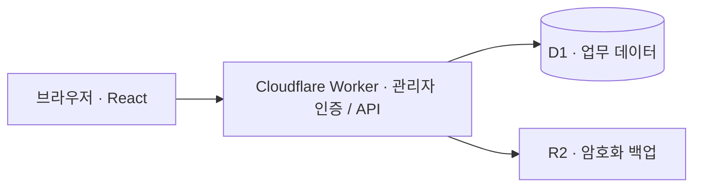

<p align="center">
  <a href="https://jipjangbu.minseop0920370667.chatgpt.site">
    
  </a>
</p>

<p align="center">
  <strong>엑셀에서 이어온 부동산 업무, 이제 어디서든.</strong><br />
  고객의 상담 이력부터 매물의 변화, 다음 연락까지 하나의 흐름으로 관리합니다.
</p>

<p align="center">
  <a href="https://github.com/seopseopi/Jipjangbu/actions/workflows/ci.yml"></a>
  
  
  
</p>

<p align="center">
  <a href="https://jipjangbu.minseop0920370667.chatgpt.site"><strong>집장부 열기 ↗</strong></a>
  &nbsp; · &nbsp; <a href="docs/usage.md">사용 안내</a>
  &nbsp; · &nbsp; <a href="docs/workflow-review.md">실제 업무 흐름 점검</a>
  &nbsp; · &nbsp; <a href="docs/search-review.md">검색 정확성 점검</a>
  &nbsp; · &nbsp; <a href="docs/performance.md">성능 개선 기록</a>
  &nbsp; · &nbsp; <a href="docs/excel-analysis.md">엑셀 이관 분석</a>
</p>

<p align="center"><sub>운영 사이트는 관리자 로그인이 필요합니다. 위 이미지는 브랜드 일러스트이며 실제 업무 화면이 아닙니다.</sub></p>

## 아버지가 쓰시던 장부에서 시작했습니다

사무실 엑셀에 쌓아온 기록을 집에서도 편하게 이어 쓰기 위해 만든 부동산 업무 관리 웹앱입니다. `업무일지(개발필요).xlsb`의 다섯 핵심 시트를 중심으로, 원본 통합문서의 VBA 동작과 추가 현황 시트까지 분석해 웹으로 옮겼습니다.

기존 기록의 관계를 이어가면서, 큰 글씨와 명확한 상태 표시, 자연스러운 화면 이동, 찾기 쉬운 검색·정렬에 집중했습니다.

## 매일 필요한 일을 한곳에서

| 화면 | 할 수 있는 일 |
| :--- | :--- |
| **오늘의 업무** | 오늘 기록, 앞으로 7일 전체 일정, 기한이 지난 연락을 확인하고 자주 하는 업무를 바로 등록 |
| **업무일지** | 날짜·고객과 넓은 본문·연결 매물을 구분 · 같은 단지 이름의 반복을 줄이고 모든 동·호수 표시 · 내용 보기에서 가격·업소 비교 |
| **고객 관리** | 이름·전화번호로 찾고, 전체 상담 이력을 확인한 뒤 다음 연락할 일 등록 |
| **매물 관리** | 건물·동·호수별 조회 · 엑셀처럼 이어 읽는 전체 매물 이력 · 개별 업무 펼쳐 보기 · 원본 메모와 기존 기록 보존 |
| **다시 연락할 일** | 고객·매물 이력을 보며 할 일 작성, 기한순 확인·완료·재개와 오늘·내일·날짜 미정 빠른 선택 |
| **업무 현황** | 최근 6개월 업무량, 업무구분별 현황, 앞으로 30일 전체 일정과 확인이 필요한 매물 파악 |
| **업무 달력** | 엑셀의 업무 유형별 표시 기준 유지 · 같은 단지 묶음과 모든 물건 표시 · 휴대폰 날짜별 목록 |
| **검색·설정** | 업무·고객·매물 통합검색, 전체 기록 CSV 내보내기, 분류 관리와 백업 다운로드 |

### 사용 흐름을 끊지 않도록

- **찾기 쉽게:** 고객·매물 검색은 정확한 일치를 우선하고, 업무는 최신순·할 일은 기한순·매물 목록은 기본적으로 건물과 동·호수순으로 보여줍니다.
- **읽기 쉽게:** 기기별 큰 글씨와 명확한 상태 표시를 제공합니다. 업무일지는 본문 5줄 미리보기와 모든 매물 주소를 보여주고, **내용 보기**에서 원문·가격·업소를 확인한 뒤 필요한 경우에만 수정합니다.
- **다시 이어가기 쉽게:** 검색 조건을 유지하며 이동하고, 로고를 누르면 홈으로 돌아옵니다. 작성 중 닫기에는 확인 절차가 있습니다.
- **수정 중에도 이력을 곁에:** 업무 입력을 유지한 채 고객·매물 이력을 펼쳐 보고, 이력에서 수정·저장하면 원래 이력으로 돌아옵니다. 펼친 업무 목록도 유지합니다.
- **지금 상태를 정확하게:** 검색 대기·갱신·조회 실패·정상 0건을 구분합니다. 저장이 성공한 뒤 목록 조회만 실패한 경우에도 성공과 재시도할 작업을 따로 안내합니다.
- **기존 고객을 빠뜨리지 않게:** 업무 등록의 고객 선택은 1,000명 이후까지 전체 명부를 읽고, 최근 업무·등록순으로 추천합니다. 고객·매물 관리 목록은 최대 1,000건 표시와 CSV 범위를 안내합니다.
- **여러 기기에서도:** 같은 관리자 계정으로 동시에 로그인할 수 있습니다. 같은 기록의 동시 편집을 병합하거나 잠그지는 않으므로, 나중 저장이 앞선 변경을 덮을 수 있습니다.

## 숫자로 보는 현재 구현

| 검증·기능 | 값 | 의미 |
| :--- | ---: | :--- |
| 자동 테스트 | **341개 통과** | 실제 API/SQL와 화면 이벤트로 누적 매물 이력·원본 중복 제거와 미포함 메모 보존·업무일/저장 시각·단지 묶음·엑셀 달력 규칙·이력 저장·검색·복귀·백업 등 회귀 검증 |
| 전체 백업 범위 | **8개 테이블** | 고객·업무·물건 상세·매물·변경 이력·업무구분·건물·할 일 |
| 한 업무에 연결할 물건 | **최대 10개** | 여러 물건을 함께 상담한 업무를 하나의 기록으로 관리 |
| 자동 백업 보관 기간 | **90일** | 장기 보관이 필요한 파일은 별도로 내려받아 보관 |

테스트 수는 **2026-09-13 검증 시점**의 기록이며, 모든 실사용 오류가 없다는 보증은 아닙니다. 최신 검사 상태와 실행 내역은 상단 CI 배지에서 확인할 수 있습니다. 운영 고객 수나 실제 업무 내용은 공개하지 않습니다.

[실제 업무 흐름 점검](docs/workflow-review.md)에는 문제의 원인·수정 범위, 합성 자료를 사용한 브라우저 검증, 운영 복원 미검증·동시 편집·초안 보관 등의 남는 한계를 함께 정리했습니다.

[가독성 개선 기록](docs/readability-review.md)에서는 묶음 업무의 반복 주소·버튼을 줄이면서 원순서와 모든 물건을 유지한 방법을 확인할 수 있습니다.

### 기다리는 시간을 줄인 구조

| 개선한 경로 | 이전 | 현재 |
| :--- | :--- | :--- |
| 화면 전환·정렬·필터 | 조회 전 300ms 대기 | 즉시 조회; 검색 입력만 250ms 지연 |
| 홈 데이터 조회 | DB 왕복 5회 | **batch 1회** |
| 검색어 없는 업무 요약의 상관 하위 조회 | 9개 | **3개** · 모든 물건 정보 포함 |
| 전체 백업 데이터 읽기 | 8개 테이블 순차 조회 | **batch 1회** |

같은 조회의 동시 요청도 하나로 합치고, 화면 코드는 필요할 때 불러옵니다. 위 숫자는 코드와 테스트로 확인한 대기·조회 구조이며, 사이트 전체 속도의 보장값은 아닙니다. 측정 방법과 합성 데이터 벤치마크는 [성능 개선 기록](docs/performance.md)을 참고하세요.

## 데이터가 저장되는 곳



| 영역 | 구성 |
| :--- | :--- |
| 화면 | React 19 · TypeScript · Tailwind CSS 4 · Lucide 아이콘 |
| 실행·빌드 | vinext · Vite · Cloudflare Workers |
| 데이터 | Cloudflare D1 / SQLite · Drizzle ORM |
| 로그인 | 비밀번호 해시 검증 · 서명된 HttpOnly 세션 쿠키 · 로그인 시도 제한 |
| 백업 | Cloudflare R2 · AES-GCM 암호화 · 변경 전후 / 이용 시 일일 / 수동 백업 |
| 검증 | GitHub Actions · ESLint · TypeScript · Node.js 테스트 러너 |

### 공개 코드와 실제 업무 데이터는 분리합니다

- 이 저장소에는 앱 코드·스키마·예시 데이터만 둡니다. 실제 고객·업무·매물 자료, 비밀번호, 운영 키, 백업 파일은 커밋하지 않습니다.
- 사이트 주소는 공개되어 있어도 업무 화면과 API는 관리자 로그인이 필요합니다. 공개 체험 계정은 제공하지 않습니다.
- **변경 전 백업에 실패하면 데이터 변경을 중단합니다.** 변경 후 백업과 수동 백업도 지원합니다.
- 일일 백업은 **사이트를 이용할 때** 실행합니다. 접속이 없어도 정해진 시각에 실행되는 예약 작업은 아닙니다.
- 다운로드한 백업은 안전한 별도 장소에 보관하세요. CSV는 화면별 자료 내보내기이며, 관계까지 복구하는 전체 백업을 대신하지 않습니다.

할 일은 직접 등록한 내용만 저장하며, 문자·전화·푸시 알림을 자동 전송하지 않습니다. 상세 동작과 주의사항은 [사용 안내](docs/usage.md)에 정리했습니다.

## 로컬 개발

**Node.js 24**와 npm을 권장합니다. 테스트는 `node:sqlite`와 `module.registerHooks`를 사용합니다.

```bash
git clone https://github.com/seopseopi/Jipjangbu.git
cd Jipjangbu
npm ci
```

[`.env.example`](.env.example)을 참고해 Git에서 제외되는 로컬 `.env`에 관리자 아이디, 비밀번호 해시, 세션 키, 백업 암호화 키를 설정하세요. 예시의 자리표시자는 실제 값이 아니며, 설정하지 않으면 로그인할 수 없습니다. 비밀번호 해시 형식은 [`worker/security.ts`](worker/security.ts)의 `verifyPassword`를 참고하세요. 개발용 키와 운영용 키는 분리합니다.

```bash
npm run dev
```

개발 서버가 출력하는 로컬 주소로 접속합니다. 로컬 개발은 별도의 D1·R2 에뮬레이터 저장소를 사용하며, 운영 데이터는 포함하지 않습니다. 로컬 실행·검사에 운영 비밀키나 실제 고객 자료는 필요하지 않습니다.

| 명령 | 역할 |
| :--- | :--- |
| `npm run dev` | 로컬 개발 서버 |
| `npm run lint` | 코드 규칙 검사 |
| `npm test` | 타입 검사 → 빌드 → 회귀 테스트 |
| `npm run build` | 배포용 빌드 |
| `npm run db:generate` | 스키마 변경 후 마이그레이션 생성 |

GitHub Actions는 `main`에 올리거나 PR을 만들 때 설치·코드 검사·타입 검사·빌드·테스트를 실행합니다. 운영 사이트를 자동 배포하거나 운영 DB를 변경하지 않습니다.

<details>
<summary>기존 엑셀 자료를 다시 이관하려면</summary>

Excel에서 개발필요 파일을 `.xlsx`로 복사 저장한 뒤 [`scripts/build_private_import.py`](scripts/build_private_import.py)로 비공개 마이그레이션을 만듭니다. 생성되는 `*_private_*.sql` 파일은 Git에서 제외됩니다. 원본 파일과 생성 결과를 공개 저장소에 넣지 마세요.

시트별 역할, 중복 처리와 원문 보존 기준은 [엑셀 분석·이관 규칙](docs/excel-analysis.md)을 먼저 확인하세요. 운영 자료를 다시 넣기 전에는 반드시 백업과 대상 환경을 확인해야 합니다.

</details>

---

<p align="center">
  <strong>기록은 차곡차곡, 업무는 한눈에.</strong><br />
  <sub>집장부 · <a href="docs/usage.md">사용 안내</a> · <a href="docs/assets/README.md">배너 제작 기록</a></sub>
</p>
