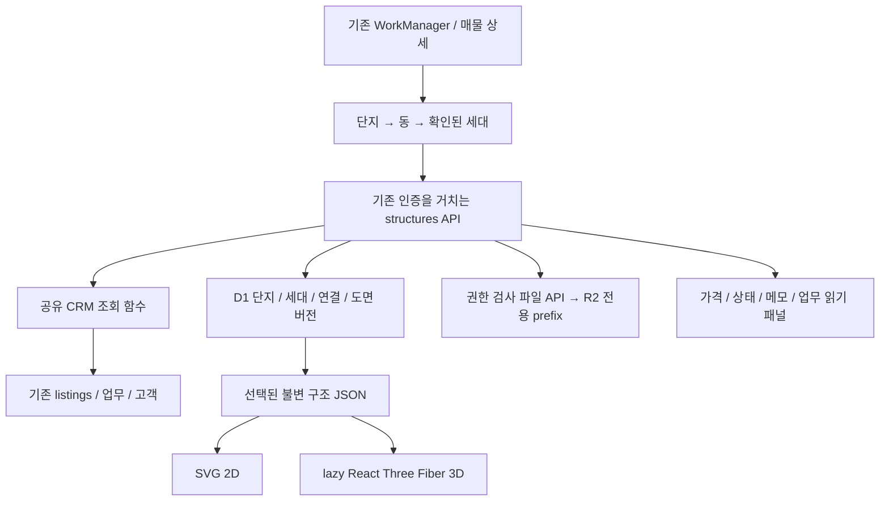
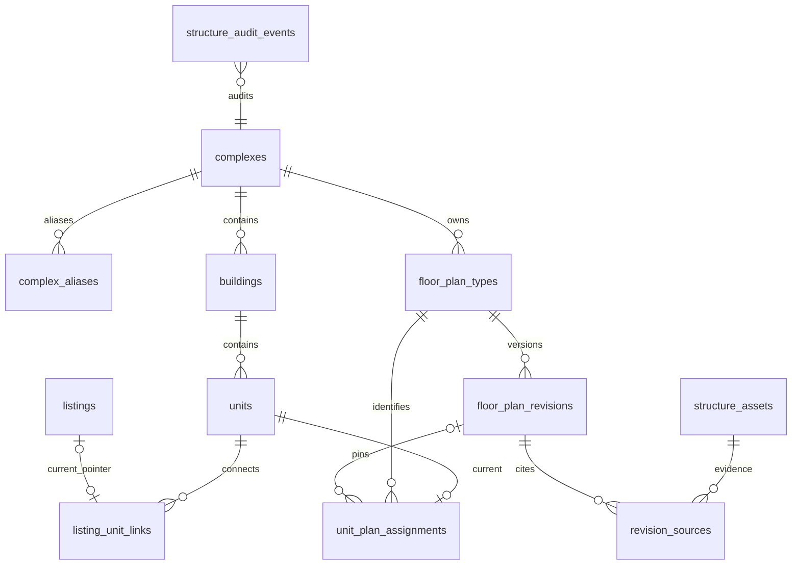

# 아파트 동·호수별 집 구조 보기 — 아키텍처 설계

작성일: 2026-09-17 · 상태: 구현 전 설계 · 기준: `devmain` / `f175e96`

> 확인된 세대를 선택하면 근거 있는 구조와 기존 매물·업무 기록을 함께 본다. 모르는 구조·치수·호수는 만들지 않는다. 이 문서는 제안이며, 기능 구현·운영 데이터 확인·DB 변경·배포를 수행했다는 뜻이 아니다.

## 1. 결정 요약과 첫 적용 범위

기존 React/vinext, Cloudflare Worker, D1, 관리자 로그인 체계를 유지한다. D1에 단지·실물 세대·불변 도면 버전·확인된 연결을 추가하고, 같은 구조 JSON을 SVG와 React Three Fiber로 렌더링한다. 원본 이미지는 기존 R2 바인딩 안의 전용 영역에 비공개 저장한다. 가격·상태·이력은 기존 CRM 조회 함수를 공유한다.

첫 적용은 **공식 단지 신원이 확인된 한 단지, 검증된 구조 타입 하나, 타입 배정이 확인된 세대 몇 개**다. 단지 배치도가 없어도 동 목록으로 출시할 수 있다. 실제 도면과 사용 권한을 확보하지 못하면 실세대 공개를 보류하며, 가상 예제는 개발 환경에서만 표시한다.

이번 범위 밖: 실내 자유 보행, 가구 배치·적합 판정, 일조량·조망, 외관 모델링, CAD 편집기, 자동 도면 인식, 모든 세대 자동 생성, 공개 고객 공유 링크. 장기적으로도 실제 측량·건축 도면을 대체한다고 안내하지 않는다.

## 2. 저장소에서 확인한 현재 구조

| 영역 | 확인한 코드 | 설계에 미치는 영향 |
|---|---|---|
| 기본 설명/데이터 | [usage.md](usage.md), [schema.ts](../db/schema.ts) | 기존 업무·고객·매물을 유지하고 새 구조 도메인을 추가한다. |
| 실행 환경 | [package.json](../package.json), [vite.config.ts](../vite.config.ts), [.openai/hosting.json](../.openai/hosting.json) | React 19.2.6, vinext 1.0.0-beta.2, Vite 8, Drizzle, D1 `DB`, R2 `BACKUPS`. 일반 Next.js 서버로 재구축하지 않는다. |
| 화면 | [page.tsx](../app/page.tsx), [work-manager.tsx](../app/work-manager.tsx) | WorkManager의 hash 메뉴·lazy 화면·읽기 모달 흐름을 확장한다. 현재 hash는 단순 메뉴 키다. |
| API/인증 | [worker/index.ts](../worker/index.ts), [security.ts](../worker/security.ts), [_shared.ts](../app/api/_shared.ts) | Worker에서 세션을 검사하며, 쓰기는 지정된 경로에 한해 동일 출처 검사·변경 전후 백업을 수행한다. |
| 현재 매물 | [listings/route.ts](../app/api/listings/route.ts), [listing-sync.ts](../db/listing-sync.ts) | `listings`는 업무 이벤트에서 재구성되는 현재 상태다. 조회 기본은 전체, 진행 중은 `closed_at IS NULL`이다. |
| 매물 이력 | [listings/[key]/route.ts](../app/api/listings/[key]/route.ts) | 변경 이벤트뿐 아니라 같은 식별키의 `work_log_properties`도 조회하므로 방문·상담만 있는 매물도 이력이 존재할 수 있다. |
| 업무 저장/복원 | [work-logs/data.ts](../app/api/work-logs/data.ts), [deletion-store.ts](../db/deletion-store.ts) | 업무 수정 때 상세 행 ID가 다시 만들어진다. 삭제·복원 때 매물 projection도 재구성된다. |
| 화면 캐시 | [client-api.ts](../app/client-api.ts) | GET 단기 캐시·중복 요청 결합·쓰기 시 무효화를 재사용한다. |
| 파일/백업 | [security.ts](../worker/security.ts) | 기존 R2는 암호화 DB 백업용이며 일반 도면 업로드 기능은 없다. 신규 파일 저장에는 백업 격리가 선행돼야 한다. |

### 기존 테이블의 실제 의미

- `property_buildings`: `property_type`, `building_name`, `sort_order`의 **분류·선택지** 테이블이다. `(property_type, building_name)`만 고유하며 공식 주소·단지 ID·동·세대가 없다. 아파트 단지 마스터로 재해석하지 않는다.
- `listings`: 건물·동·호수·타입 표시, 가격 문자열, 상태, 메모가 있는 파생 테이블이다. 가격을 새 숫자 계산식으로 재해석하지 않는다.
- `listing_events`: 매물 상태 변경에 기여하는 업무 이벤트다. 모든 집방문·상담이 이 테이블에 들어가지는 않는다.
- `work_logs`와 `work_log_properties`: 고객과 연결된 업무 및 여러 물건 상세다. 한 업무가 여러 세대에 걸칠 수 있다.
- 현재 매물 키는 `[propertyType, buildingName, buildingDong, unitNumber]` 각각 trim/소문자 처리 후 `|`로 결합한다. 동·호 접미사나 별칭을 자동 통합하지 않는다.

**ID 주의:** 마지막 매물 이벤트 삭제 시 `listings` 행이 사라지고, 재등록·복원 시 UUID가 달라질 수 있다. 업무 상세 ID도 수정 때 재생성된다. 물리 세대의 영구 식별자로 둘 중 어느 것도 사용하지 않는다.

브랜치 차이: 조사 시 `main`에는 `devmain` 이후 `bbca8c2`, `729f4a9`, `0174aea`, `eb23a61`의 로고·대비·줄바꿈·Pretendard 변경이 있다. 이 작업에서 합치지 않았다. 구현 착수 전 디자인 변경 반영 여부를 정하고, 기존 폰트·토큰을 재사용한다. 운영 DB와 실제 세대 매핑은 이번에 조회·검증하지 않았다.

## 3. 구성과 책임



서버는 확인 상태·접근 권한·매핑·도면 검증·CRM 결합을 책임진다. 프런트는 선택·렌더링·출처 표시만 담당하며, 업무 구분으로 가격이나 진행 상태를 추론하지 않는다. 기존 단일 관리자 모델을 그대로 사용한다. 별도 사용자/역할 체계를 도입한 것처럼 가정하지 않는다.

### 의존성 선택

- 3D: `three` + `@react-three/fiber` **9 계열** + 개발 타입 `@types/three`. React 19와의 대응은 [공식 설치 문서](https://r3f.docs.pmnd.rs/getting-started/installation)를 따른다. 실제 구현 시 호환 패치를 검증해 lockfile에 고정한다.
- 카메라: Three.js의 `OrbitControls`를 작은 React 어댑터로 감싼다. 초기에는 drei·CSG·물리 엔진을 추가하지 않는다.
- 2D: 기존 React의 SVG. 3D 라벨은 투영 좌표를 사용하는 HTML 오버레이로 만들어 글꼴을 공유한다.
- 검증: 서버·클라이언트 공용 순수 TypeScript 검증기. 형태뿐 아니라 도형 교차·참조·치수 범위를 검사한다. 브라우저 검증만 신뢰하지 않는다.

## 4. 데이터 모델

다음은 **신규 제안**이다. UUID는 TEXT, 시각은 UTC ISO 문자열, 불리언은 INTEGER 0/1 CHECK를 사용한다. `?`는 nullable이며 나머지는 NOT NULL이다. 가변 관리 행은 `created_at`, `updated_at`, `row_version`(기본 1)을 가진다. 모든 FK를 실제 D1 제약으로 만들고, Drizzle relations만으로 대신하지 않는다.



| 테이블 | 주요 필드 | 제약·인덱스·삭제 정책 |
|---|---|---|
| `complexes` | `id`, `official_name`, `address`, `external_reference?`, `site_asset_id?`, `identity_evidence`, `verified_at?`, `archived_at?`, `is_demo` | 이름만으로 UNIQUE 처리하지 않는다. 검증된 외부 식별자는 공급자와 함께 UNIQUE. 이름 검색 인덱스. 하위 데이터가 있으면 삭제 RESTRICT, 기본은 보관 처리. |
| `complex_aliases` | `id`, `complex_id`, `property_type`, `alias`, `normalized_alias`, `evidence`, `confirmed_at` | UNIQUE(complex_id, property_type, normalized_alias), 검색 인덱스(property_type, normalized_alias). 같은 별칭이 여러 단지에 존재할 수 있다. FK RESTRICT. |
| `buildings` | `id`, `complex_id`, `display_name`, `normalized_name`, `verified_floors_json?`, `site_region_json?`, `site_asset_id?`, `evidence`, `verified_at?`, `archived_at?` | UNIQUE(complex_id, normalized_name). 층 목록은 확인된 층만. 배치 영역은 원본 asset 버전과 결합된 0~1 좌표 다각형. 세대 있으면 삭제 RESTRICT. |
| `units` | `id`, `building_id`, `unit_number`, `normalized_unit_number`, `floor_number?`, `floor_label?`, `evidence`, `verified_at`, `archived_at?` | UNIQUE(building_id, normalized_unit_number), INDEX(building_id, floor_number). 층 미확인은 NULL 허용. 연결 있으면 RESTRICT. 호수 문자열을 숫자로 강제하지 않는다. |
| `floor_plan_types` | `id`, `complex_id`, `type_code`, `display_name`, `exclusive_area_m2?`, `supply_area_m2?`, `area_evidence?`, `description`, `archived_at?` | UNIQUE(complex_id, type_code). 면적은 양수 CHECK, 실제 자료에 없는 값은 NULL. 33평 같은 이름은 display_name에만 보관한다. 동일 면적은 동일 구조의 근거가 아니다. |
| `floor_plan_revisions` | `id`, `type_id`, `version`, `variant`(base/expanded/remodeled), `geometry_json?`, `geometry_hash?`, `schema_version?`, `scale_status`(unknown/proportional/verified), `status`(draft/validated/withdrawn), `verified_at?`, `verification_note`, `published_at?` | UNIQUE(type_id, version), INDEX(type_id, status). JSON 유효성 CHECK. geometry 없는 이미지 전용 버전 허용. validated 이후 내용 불변, 정정은 새 버전. 참조된 버전 삭제 RESTRICT. 철회는 화면 경고/노출 제한이며 조용한 대체 금지. |
| `revision_sources` | `revision_id`, `asset_id`, `role`(plan/evidence), `page_number?`, `annotation` | 복합 PK(revision_id, asset_id, role). 양쪽 FK RESTRICT. 버전 검증 후 근거 연결도 불변. |
| `unit_plan_assignments` | `unit_id` PK, `type_id`, `revision_id?`, `mirror_x?`, `rotation_deg?`, `north_bearing_deg?`, `orientation_status`, `actual_condition`(unknown/base/expanded/remodeled), `condition_verified_at?`, `mapping_evidence`, `confirmed_at`, `notes` | 세대당 현재 연결 하나. 타입만 확인된 경우 revision NULL. INDEX(revision_id). revision/type 일치는 복합 FK, unit/type 단지 일치는 DB trigger와 서비스 검사. 방향 NULL을 0으로 간주하지 않는다. FK RESTRICT. |
| `listing_unit_links` | `id`, `unit_id`, `identity_key`, `listing_id?`, `identity_parts_json`, `evidence`, `confirmed_at`, `row_version` | UNIQUE(identity_key), UNIQUE(listing_id), INDEX(unit_id). unit FK RESTRICT, listing FK **ON DELETE SET NULL**. 재생성되는 현재 매물 ID와 영구적인 확인 키를 구분한다. |
| `structure_assets` | `id`, `object_key`, `sha256`, `mime_type`, `bytes`, `width?`, `height?`, `original_name`, `source_url?`, `provider`, `acquired_at`, `permission_scope`(pending/internal_allowed/denied), `permission_evidence`, `status`(pending/ready/retired), `is_demo` | UNIQUE(object_key). object_key는 서버 생성, 덮어쓰기 금지. 인덱스(status, acquired_at). 참조 중 삭제 RESTRICT. 원본명/URL의 개인정보는 필요한 범위만 보관. |
| `structure_audit_events` | `id`, `complex_id`, `entity_type`, `entity_id`, `action`, `before_json?`, `after_json?`, `actor`, `request_id`, `created_at` | INDEX(entity_type, entity_id, created_at), UNIQUE(request_id, entity_type, entity_id, action). append-only. actor는 기존 인증 주체, 비밀번호·세션 값 저장 금지. |

타입·세대·파일의 `is_demo`는 단지의 구분과 일치해야 한다(서비스 검사 + DB trigger). assignment와 link 변경은 이전/이후 값을 audit에 남긴다. 이력 JSON은 물리 FK 대신 당시 식별자/내용을 보존한다. 도면에 들어 있는 방·벽 ID는 버전 내부 ID이며 CRM ID와 무관하다.

### 매물 연결의 핵심 규칙

1. 기존 `listings.id`와 `identity_key`를 바꾸지 않는다. 새 link 행에 정확한 기존 키와 확인 근거를 저장한다. 현재 listing이 없어도 방문 기록의 키를 확인해 `listing_id=NULL`로 연결할 수 있다.
2. 이름·동·호수 정규화는 **후보 검색 전용**이다. 접미사 제거, 별칭, 비슷한 이름만으로 확정하지 않는다. 후보 화면에 공식 주소·원래 문자열·동·호·기존 연결을 나란히 표시하고 사용자가 확정한다.
3. 한 identity_key는 한 세대에만 연결한다. 한 세대에 여러 별칭의 CRM 키가 연결될 수 있다. 현재 매물 여러 건은 모두 출처/이름과 함께 보여주고 가격을 하나로 합치거나 최신값 하나를 임의 선택하지 않는다.
4. `listingRebuildStatements`에 정확한 identity_key의 nullable 현재 포인터 재연결을 추가한다. 업무 저장·삭제·복원의 **같은 D1 batch**에서 처리한다. alias 추론에 의한 자동 재연결은 하지 않는다. 읽기에서도 identity_key로 현재 projection을 조회하여 포인터만 맹신하지 않는다.
5. 업무 수정으로 건물·동·호가 바뀌어 새 키가 생기면 새 후보다. 예전 link를 다른 세대로 자동 이동하지 않는다. 이전 키의 남은 기록은 유지하고 새 키의 연결 확인을 요청한다.
6. 영구 삭제 후에는 기존 CRM 정책에 따라 업무가 사라진다. 구조 기능이 지운 업무를 별도 사본에서 되살리지 않는다. 연결 이력은 남지만 업무 본문은 복제하지 않는다.

## 5. 공통 구조 JSON과 렌더링 계약

### 좌표와 검증

- 평면 좌표는 오른손 XY, 높이는 Z, 단위는 m. 원점은 도면에 명시한 기준점이다. SVG에서는 Y 반전과 글자 정방향 처리를 하고, Three에는 `[x, z, -y]`로 변환한다.
- 비례만 확인된 자료는 **명목 m 좌표**로 저장하되 `scaleStatus=proportional`, `calibration=null`을 강제한다. 실제 미터 길이를 안다는 의미가 아니다. 치수·면적·가구 적합 출력은 비활성화한다. 길이를 검증한 경우에만 출처와 축척 calibration을 넣는다.
- 단지 배치도는 파일의 0~1 이미지 좌표이며 내부 미터 좌표와 변환하지 않는다. 배치도 변경 시 영역도 다시 검증한다.
- assignment 변환은 원점이 아닌 명시한 pivot에 대해 `T(pivot) · R(theta) · MirrorX · T(-pivot)` 순서다. 변환을 공통 함수 하나로 적용하고 방·벽·개구부·라벨·hit-test에 공유한다. 반전 후 문 열림 호의 방향도 determinant에 맞게 반전한다.
- 방위는 확인된 북쪽 방향 정보이고 카메라 회전과 별개다. 방향이 미확인되면 타입 원본 방향으로만 보여주고 `세대 방향 미확인`을 표시한다. 반전이 미확인인 경우에도 실제 세대 그대로라고 표현하지 않는다.

### 대표 JSON (가상 개발용, 실제 아파트 도면 아님)

아래는 계약을 설명하는 작은 4영역 예제다. 치수는 모두 임의이며 실단지에 등록할 수 없다. 실자료는 원본과 대조해 벽·통로·개구부를 빠짐없이 작성해야 한다.

```json
{
  "schemaVersion": 1,
  "isDemo": true,
  "coordinateSystem": { "unit": "m", "plane": "XY", "up": "Z", "origin": [0, 0], "pivot": [3, 2] },
  "scaleStatus": "proportional",
  "calibration": null,
  "dimensionEvidence": { "status": "illustrative", "sourceAssetId": null, "note": "가상 예제, 실측 아님" },
  "outline": [[0, 0], [6, 0], [6, 4], [0, 4]],
  "rooms": [
    { "id": "living", "name": "거실", "polygon": [[0, 0], [3, 0], [3, 2], [0, 2]], "label": [1.5, 1] },
    { "id": "kitchen", "name": "주방", "polygon": [[3, 0], [6, 0], [6, 2], [3, 2]], "label": [4.5, 1] },
    { "id": "bedroom", "name": "방", "polygon": [[0, 2], [3, 2], [3, 4], [0, 4]], "label": [1.5, 3] },
    { "id": "bath", "name": "욕실", "polygon": [[3, 2], [6, 2], [6, 4], [3, 4]], "label": [4.5, 3] }
  ],
  "walls": [
    { "id": "south", "start": [0, 0], "end": [6, 0], "thickness": 0.15, "height": 2.4 },
    { "id": "east", "start": [6, 0], "end": [6, 4], "thickness": 0.15, "height": 2.4 },
    { "id": "north", "start": [6, 4], "end": [0, 4], "thickness": 0.15, "height": 2.4 },
    { "id": "west", "start": [0, 4], "end": [0, 0], "thickness": 0.15, "height": 2.4 },
    { "id": "middle", "start": [0, 2], "end": [6, 2], "thickness": 0.1, "height": 2.4 },
    { "id": "upper", "start": [3, 2], "end": [3, 4], "thickness": 0.1, "height": 2.4 }
  ],
  "doors": [
    { "id": "entry", "wallId": "south", "offset": 0.4, "width": 0.9, "height": 2.0, "hinge": "start", "opensTo": "left", "angleDeg": 90 },
    { "id": "bed", "wallId": "middle", "offset": 0.5, "width": 0.8, "height": 2.0, "hinge": "start", "opensTo": "left", "angleDeg": 90 },
    { "id": "bath-door", "wallId": "middle", "offset": 4, "width": 0.8, "height": 2.0, "hinge": "end", "opensTo": "left", "angleDeg": 90 }
  ],
  "windows": [
    { "id": "living-window", "wallId": "west", "offset": 2.4, "width": 1.2, "height": 1.0, "sillHeight": 0.9 }
  ]
}
```

offset은 벽 start에서 end 방향으로 개구부 시작점까지의 거리다. 문은 바닥 높이 0에서 시작한다. left/right는 벽 진행 방향의 평면상 좌/우다. 재질·외부 URL·실행 가능한 코드는 JSON에 넣지 않는다.

### 벽과 실제 개구부

벽마다 개구부의 가로 경계와 높이 경계로 로컬 `(거리, 높이)` 면을 분할한다. 문·창 영역을 제외한 직사각형만 두께만큼 입체화한다. 문 위 인방과 창 아래/위 벽은 남긴다. 구멍 위에 벽 박스를 그대로 두고 색칠하는 방식은 쓰지 않는다. 문짝/창틀은 구멍 안 별도 mesh이며 SVG도 같은 구간을 사용한다. 벽 교차부 중복 면은 정리하고, 겹치는 개구부는 입력 오류로 거절한다. 초기에는 직선 벽만 지원한다.

검증기는 schemaVersion, 유한 좌표, 양의 벽/개구 치수, 참조 ID, 단순 다각형, 라벨의 방 내부 위치, 개구부의 벽 길이/높이 범위, 개구 중첩, 방/외곽 관계를 검사한다. 초기 상한은 JSON 512 KiB, 방 100개, 벽 500개, 개구부 500개로 잡고 실제 자료로 조정한다. 큰 파일은 조용히 일부만 렌더링하지 않고 거절한다.

2D/3D 전환 시 선택한 roomId를 유지한다. 기본 3D는 천장 없는 조감·바닥·벽·문창·이름만 제공한다. 회전/확대/초기화 버튼에 텍스트를 붙이고 키보드 대안과 방 목록을 제공한다. 자유 보행은 없다.

## 6. 사용자 화면과 탐색 흐름

1. **단지 찾기:** 확인된 complexes와 별칭을 검색한다. 아직 연결되지 않은 기존 장부 이름은 `단지 연결 필요` 후보로 구분한다. `3D 준비 / 2D만 준비 / 자료 없음`, `진행 중 N · 전체 M`를 표시한다. 수는 확인된 link와 실제 listings의 COUNT DISTINCT(id)로 계산한다. 진행 중 기준은 기존 `closed_at IS NULL`이고, 미연결 매물은 별도 N건으로 알려 누락을 숨기지 않는다. 1000건 제한 목록을 프런트에서 세어 집계하지 않는다.
2. **동 선택:** 근거 있는 배치도와 영역이 있으면 선택 가능한 hotspot을 제공한다. 없으면 같은 기능의 동 버튼 목록. 숫자 동 자연 정렬 + ID tie-breaker. 배치도·목록 모두 선택/매물 수를 텍스트로 표시한다.
3. **세대 선택:** 확인된 층은 높은 층부터, 호수는 자연 정렬한다. 실제 등록된 units만 셀로 만들며 누락 셀은 `확인된 자료 없음`이지 빈집이 아니다. 층 NULL은 `층 미확인` 목록에 둔다. 매물 유무와 도면 준비 상태는 색뿐 아니라 글자/아이콘으로 구분한다.
4. **구조와 CRM:** 상단에 단지·동·호수 breadcrumb와 `기본형/실세대 확인 여부/치수 상태`를 고정 표시한다. 데스크톱은 넓은 구조 영역과 우측 CRM 패널, 모바일은 `구조 / 매물·이력` 탭. 긴 메모가 버튼 때문에 좁아지지 않도록 행동 버튼은 별도 줄에 배치한다.
5. **기존 매물에서:** 현재 매물 및 이력 화면에 `집 구조 보기`를 추가한다. 확정 link가 없으면 잘못된 도면 대신 `세대 연결 필요` 안내와 연결 관리로 이동한다. 업무 기록을 누르면 기존 읽기 모달을 열며 수정 화면으로 바로 보내지 않는다. 복사·수정·삭제·휴지통은 기존 흐름을 사용한다.

WorkManager에 `structures` 메뉴를 추가하고 hash parser/serializer를 공용 함수로 분리한다. 예: `#structures?complex=c1&building=b1&unit=u1`. 문자열 전체를 View로 cast하는 현재 코드를 그대로 두지 않는다. 뒤로 가기·새로고침·잘못된 ID·삭제된 연결을 처리하고, 돌아오면 원래 매물 목록의 검색/스크롤/포커스를 복원한다. 기존 미저장/저장 중 이동 가드를 재사용한다.

### 불완전한 정보 표시

| 상태 | 표시·행동 |
|---|---|
| 세대→타입 미확인 | `이 세대의 구조는 아직 확인되지 않았습니다`. 단지 타입 목록은 참고 영역에서만 보여주고 세대 도면처럼 배치하지 않는다. |
| 타입 확정, 3D 미제작 | 권한 확인된 원본 2D 이미지와 출처를 표시. geometry가 없으면 3D 버튼 대신 `3D 준비 전`. |
| 기본형만 확보 | `기본형 참고도 / 실제 확장 여부 미확인`. 실제 상태가 확장형으로 확인돼도 대응 버전이 없으면 기본형을 실제 모습으로 표현하지 않는다. |
| 방향/반전 미확인 | `타입 기준 방향 · 세대 방향 미확인`. 북쪽 화살표를 만들지 않는다. 원본 이미지가 geometry에 정합되지 않았으면 임의 회전/반전도 하지 않는다. |
| 치수 미검증 | `배치 참고용 · 실측 아님`, 측정/면적계산/가구 적합 판정 없음. |
| WebGL 불가·context loss·3D 로드 실패 | 에러 경계에서 SVG/원본 2D로 복귀. CRM 패널은 계속 사용 가능. |
| 도면 없음/권한 없음/철회 | 상태와 필요한 자료 표시. 데모 도면 자동 대체 금지. |

## 7. 서버 함수와 API 계약

기존 `app/api/listings/[key]/route.ts`의 조회를 `db/listing-read.ts`로 추출한다. 기존 API도 동일 함수를 호출하도록 회귀 테스트한다. 신규 단위 조회는 **확정된 identity_key 집합**으로 이벤트와 work_log_properties를 결합한다. 현재 listing 없음 + 방문 이력 있음도 정상 응답한다. 업무는 work_log ID로 중복 제거하되 한 업무의 연결 물건은 그대로 제공한다. 기존 고객·물건지 표시 규칙과 업무구분 필터를 유지한다.

업무 정렬은 기존 매물 이력 의미를 유지해 업무일 DESC, 저장 시각 DESC, ID tie-breaker로 고정하고 화면에 명시한다. 최초 50건 및 동일 정렬 키의 cursor pagination을 사용한다. 도면별 API가 업무 집계 로직을 복제하거나 서버 내부 HTTP 호출을 하지 않는다.

| API (모두 `/api/structures` 아래) | 계약 |
|---|---|
| `GET /complexes?q=&cursor=` | 단지/별칭 검색, 준비 상태, 확인된 연결 매물 집계. 후보는 confirmed와 분리. |
| `GET /complexes/:id/buildings` | 동 목록, 출처 승인된 배치도 URL, 검증된 hotspot, 집계. |
| `GET /buildings/:id/units` | 확인된 세대 목록·층·assignment 상태·매물 수. 전체 호수 자동 생성 없음. |
| `GET /units/:id` | 아래 응답처럼 세대/assignment/현재 매물/첫 업무 페이지/경고를 반환. geometry는 별도. |
| `GET /units/:id/work-logs?workType=&cursor=` | 공유 CRM 조회. 필터·페이지를 바꿔도 확정된 모든 키의 방문/상담 포함. |
| `GET /revisions/:id` | 검증/사용 가능 상태와 공통 geometry JSON, 출처. 초안은 관리 흐름에서만. |
| `GET /assets/:id` | 세션·파일 권한·메타 상태 확인 후 R2 stream. raw object key 접근 금지. |
| `GET /link-candidates?identityKey=` | 원래 CRM 문자열과 단지/동/세대 후보, 모호한 이유. 자동 확정 없음. |
| `POST /complexes`, `/buildings`, `/units`, `/types` | 확인 자료와 함께 관리 엔티티 생성. 일반 메모 입력으로 공식 세대 자동 생성하지 않는다. |
| `POST /assets` | 제한된 multipart 이미지 업로드 → pending/ready 메타 처리. |
| `POST /types/:id/revisions` | 새 초안 생성; 이전 버전 복제 가능하나 새 ID 부여. |
| `PUT /revisions/:id/draft` | 초안 JSON·출처 변경, expectedVersion 필수. |
| `POST /revisions/:id/validate`, `/revisions/:id/withdraw` | 근거/권한/geometry 검사 후 검증 확정 또는 이유를 남겨 철회. 기존 연결을 다른 버전으로 이동하지 않는다. |
| `PUT /units/:id/assignment` | 타입·버전·반전·회전·실상태·근거, expectedVersion; 해제는 확인 후 DELETE. |
| `PUT /listing-links/:id` 및 `POST /listing-links` | 기존 키/세대 확인 연결. 충돌 시 409, 후보 자동 이동 금지. 해제는 감사 로그와 함께 DELETE. |

관리 엔티티 수정은 대응 PATCH + expectedVersion, 제거 대신 `archived_at`을 기록한다. 초기 대량 매핑 API는 만들지 않는다. 새 도면을 적용할 세대를 개별 선택·미리보기·확인하게 한다.

다음은 **합성 API 예시**이며 실데이터가 아니다. 예제 ID의 API는 구현 전이다.

```json
{
  "unit": { "id": "demo-u1", "complexName": "데모 단지", "buildingName": "예시동", "unitNumber": "예시호", "floorNumber": null },
  "assignment": { "typeId": "demo-t1", "revisionId": "demo-r1", "variant": "base", "mirrorX": null, "rotationDeg": null, "northBearingDeg": null, "actualCondition": "unknown" },
  "plan": { "geometryUrl": "/api/structures/revisions/demo-r1", "sourceImageUrl": null, "scaleStatus": "proportional", "revisionVersion": 1 },
  "crm": {
    "listings": [{ "id": "demo-listing", "identityKey": "아파트|데모 단지|예시동|예시호", "salePrice": "가격 미기입", "jeonsePrice": "", "monthlyRent": "", "status": "매물등록", "notes": "합성 예제", "closedAt": null }],
    "workLogs": [{ "id": "demo-work", "workDate": "2026-09-17", "workType": "집방문", "customer": { "id": "demo-customer", "name": "예시 고객" }, "content": "방 배치 설명", "properties": [{ "buildingName": "데모 단지", "buildingDong": "예시동", "unitNumber": "예시호", "source": "" }] }],
    "nextCursor": null
  },
  "warnings": ["개발용 가상 구조입니다", "실제 확장 여부 미확인", "세대 방향 미확인", "치수 미검증"],
  "isDemo": true
}
```

assignment PUT 예:

```json
{
  "expectedVersion": 3,
  "typeId": "demo-t1",
  "revisionId": "demo-r1",
  "mirrorX": false,
  "rotationDeg": 0,
  "northBearingDeg": null,
  "orientationStatus": "plan_relative_confirmed",
  "actualCondition": "unknown",
  "mappingEvidence": "개발용 매핑 테스트",
  "notes": "실단지 연결 불가"
}
```

오류: 401 인증 필요, 403 출처 검사/사용 범위 위반, 404 없음, 409 버전·연결 충돌, 413 크기 초과, 422 `fieldErrors` 검증 실패, 503 변경 전 백업 실패. 요청 재전송에는 idempotency requestId를 사용해 도면 버전/감사 기록이 중복 생성되지 않게 한다.

### 원자성·동시 수정

관련 D1 변경과 audit는 한 `DB.batch`에 넣는다. [D1 공식 문서](https://developers.cloudflare.com/d1/worker-api/d1-database/)의 batch 트랜잭션 동작을 사용하며, 임의 BEGIN/COMMIT이나 R2까지의 원자성을 가정하지 않는다.

읽고 검사한 뒤 무조건 UPDATE하는 방식은 금지한다. 가변 행 UPDATE는 요청의 expectedVersion+1을 row_version으로 설정하고, DB trigger가 `NEW.row_version = OLD.row_version + 1`을 검사해 stale write를 ABORT한다. 변경 행 존재 검사와 audit 기록도 mutation token/동일 batch의 guard로 연결해 삭제된 행에 가짜 성공 audit를 남기지 않는다. 신규 assignment의 동시 생성은 unit PK로 차단한다. 버전 확정과 매핑은 같은 단지·validated 상태·사용 권한을 DB guard로 재검사한다. 잘못된 한 항목이면 전체 rollback한다.

## 8. 출처 확보·파일 저장·백업

### 준비 → 등록 절차

1. 공식 단지 이름·주소와 장부 별칭의 대응을 담당자가 확인한다.
2. 원본을 확보하고 공급자·URL·취득일·이용 허락 범위·근거를 입력한다. 인터넷에서 볼 수 있다는 이유만으로 복제/서비스 저장 권한이 있다고 간주하지 않는다.
3. 전용/공급면적과 타입 코드를 구별해 등록한다. 면적만으로 세대 타입을 정하지 않는다.
4. 외부 제작 도구 또는 개발 작업에서 구조 JSON을 만든다. 출처가 없는 치수는 verified로 올리지 않는다.
5. 원본과 SVG/3D를 나란히 대조해 벽·문창·방 이름·반전·확장형·치수 상태를 체크한다. 확인자/시각/근거를 남기고 버전을 validate한다.
6. 확인된 세대에 특정 버전을 연결한다. 관리 화면은 타입 선택, 버전 미리보기, 반전/회전, 실제 상태, 출처·메모 입력 정도로 제한한다.
7. 새 버전은 기존 연결에 자동 적용하지 않는다. 사용자가 대상 세대와 변경 전후 도면을 확인한 뒤 개별 적용한다. 이전 버전으로 되돌리기도 동일한 명시적 변경이다.

### R2 저장 결정과 필수 선행 수정

현재 사용 가능한 `BACKUPS` 바인딩을 재사용하고 파일은 `structure-assets/<uuid>/<sha256>.<ext>`에 저장한다. 공개 bucket URL을 만들지 않는다. 승인된 PNG/JPEG/WebP만 초기 지원하며 PDF 원본은 외부 보관 후 사용 허락된 페이지 이미지로 등록한다. SVG/HTML 업로드는 거절한다. MIME/magic bytes·10 MiB·최대 20MP를 검사하고 표시용 이미지 생성 과정에서 EXIF를 제거한다. 서버가 외부 URL을 대신 다운로드하지 않아 SSRF를 피한다.

**현재 위험:** `listBackupSummaries`와 `removeExpiredBackups`는 prefix 없이 R2 전체를 순회하며, 후자는 90일 경과 객체를 삭제한다. 그대로 파일을 넣으면 도면이 백업 목록에 섞이고 삭제될 수 있다. 기능 출시 전 반드시 다음을 먼저 구현·회귀 테스트한다.

- 백업 목록·만료 삭제·다운로드를 기존 `daily/`, `manual/`, `changes/`의 허용된 백업 키로만 제한한다. 실제 생성 키 형식/메타까지 검사한다. 도면 prefix는 절대 백업 만료 대상으로 취급하지 않는다.
- `BACKUP_TABLES`에 신규 메타·도면·연결·audit 테이블을 추가한다. 기존 v1 복원과 구분되는 버전 manifest를 정의하고 구버전 복원 시 새 도메인을 비우는 위험을 안내/차단한다.
- DB 백업에는 객체 key/hash/크기 manifest를 포함한다. **메타데이터 백업만으로 이미지를 복구할 수 없으므로**, 암호화된 DB 백업과 파일을 함께 외부 보관하는 관리자 export/복구 절차도 출시 조건으로 둔다. R2 객체를 지우지 않는 것만으로 독립 백업이라고 부르지 않는다.
- 활성/보존 중인 백업이 참조하는 파일은 자동 삭제하지 않는다. 초기에는 업로드 실패 후 미참조 pending 파일만 유예기간 후 정리한다. 참조된 파일은 retire로 숨기고 물리 삭제하지 않는다.

R2와 D1은 단일 트랜잭션이 아니다. 업로드 흐름은 pending 메타 생성 → 불변 key에 업로드 → hash 확인 → ready 전환이다. 실패 상태는 재시도 가능하고 ready 파일만 도면에 연결한다. 복원은 격리 환경에서 파일 존재/hash → 메타/버전 → 세대 연결 → CRM 키 재연결 순으로 검증한 뒤 진행한다. 암호화 키 분실 시 복구할 수 없다는 운영 조건도 기록한다.

신규 `structures` 쓰기 경로는 `isBusinessMutation`에 포함시켜 기존 동일 출처 검사와 변경 전후 백업을 적용한다. 파일 조회도 인증 예외 정적 경로에 넣지 않는다. 파일 응답은 허용 MIME과 `nosniff`, 비공개 캐시 정책을 적용한다.

## 9. 실제 파일 배치와 성능

아래는 구현 시 추가/수정할 위치이며, 이번 설계 작업에서 생성하는 파일은 이 문서뿐이다.

```text
app/
  work-manager.tsx                    # structures 메뉴, 진입/복귀, 갱신 연결
  navigation.ts                      # 기존 hash + 구조 선택 parser/serializer
  structures/
    structure-view.tsx               # 선택 상태/화면 조합 (lazy)
    complex-picker.tsx
    building-picker.tsx
    unit-grid.tsx
    plan-viewer.tsx                  # 2D/3D/자료 없음 분기
    plan-svg.tsx
    plan-three.tsx                   # 유일한 R3F 진입점 (lazy)
    crm-panel.tsx                    # 기존 업무 읽기 callbacks
    source-status.tsx
    mapping-manager.tsx
    revision-manager.tsx
  api/structures/                    # 7절 경로별 route.ts
db/
  schema.ts                          # 신규 엔티티
  structure-store.ts                 # 조회/원자적 변경
  structure-crm.ts                   # 확정된 identity_key 집합 결합
  listing-read.ts                    # 기존/신규 공유 CRM reader
  listing-sync.ts                    # 현재 pointer 재연결
lib/structures/
  types.ts
  validate.ts
  transform.ts
  wall-openings.ts
worker/
  security.ts                        # mutation/백업 prefix/manifest
  structure-assets.ts                # 인증된 파일 I/O
drizzle/<next>_structures.sql         # 현재 0000~0005; 다음 번호는 착수 때 확인
tests/                               # 기존 테스트 방식에 맞춘 단위/API/회귀
docs/apartment-structure-architecture.md
```

- 홈·업무일지 진입 번들에 Three.js를 포함하지 않는다. 구조 메뉴 및 3D 탭에서 각각 lazy import한다. 3D는 브라우저에서만 mount하여 SSR의 WebGL 의존을 피한다.
- 단지 전체 geometry를 내려받지 않는다. 선택된 revision만 조회하고 검증된 불변 JSON은 revision ID+hash 기반 메모리 LRU(초기 5개/5 MiB)로 공유한다. 상태/권한/철회 확인은 별도 메타 조회로 갱신한다. 로그아웃 시 캐시를 모두 지운다. 공개 CDN·localStorage에 업무/도면을 저장하지 않는다.
- CRM GET은 기존 단기 캐시를 사용한다. `afterMutation`에서 구조 패널도 무효화/재조회한다. 다른 창의 변경은 창 focus/visibility 복귀 시 재조회한다. 불변 geometry까지 다시 다운로드하지 않는다.
- 세대 선택 요청은 AbortController/선택 토큰으로 이전 응답을 취소 또는 폐기한다. 늦은 A세대 응답이 B세대 제목 아래 나타나는 것을 방지한다.
- R3F는 필요 시 렌더링하고 DPR을 최대 1.5로 제한한다. 그림자/고해상도 텍스처는 초기 제외. controls 변화 시 invalidate한다.
- 화면 종료 시 controls/listener/observer를 해제하고 geometry/material/texture를 dispose한다. 자동 해제 범위 밖의 수동 객체도 정리한다. [R3F 객체 수명 문서](https://r3f.docs.pmnd.rs/api/objects)를 기준으로 StrictMode 재마운트와 반복 탭 전환을 시험한다.
- 합격 목표(구현 후 실측): 기존 홈 번들에 3D 청크 미포함, 세대 30회 전환 후 살아 있는 canvas 1개 이하·리스너 누적 없음, 대상 모바일에서 조작 30fps 이상. 네트워크/기기 조건을 기록하며 초기 목표이지 현재 측정 결과는 아니다.

## 10. 확보한 자료와 미확인 사항

[KB 검단힐스테이트 페이지](https://kbland.kr/se/c/14727)를 2026-09-17 확인했다. 페이지에는 94·109·148㎡의 기본형 평면도 항목이 있으나, 이번 조사에서 이미지 원본을 취득·치수 검증하거나 사용 허락을 확보하지 않았다. 페이지의 단지명과 장부의 `힐스테이트1차`가 동일 대상인지도 담당자 확인이 필요하다. 타입 표기를 전용면적으로 확정하지 않는다.

| 자료 | 현재 상태 | 실세대 출시 전 필요한 것 |
|---|---|---|
| 저장소 스키마/조회/인증 | 코드 확인 | 구현 시 브랜치 기준 재확인 |
| 장부 별칭→공식 단지 | 후보만 존재 | 공식 주소/식별자 대조 |
| 평면도 이미지 | 참고 페이지 항목 존재 | 원본·사용 범위·원본 보관 위치 |
| 타입별 면적/구조 | 표시 이름만 참고 가능 | 전용/공급 구분, 구조 차이 확인 |
| 동·호·층→타입 | 확보 안 됨 | 관리 자료 또는 확인 가능한 현장/공식 근거 |
| 반전/방위/확장/리모델링 | 확보 안 됨 | 세대별 확인, 모르는 값은 NULL/unknown |
| 치수 | 검증 안 됨 | 축척 근거/치수 자료; 없으면 참고용 유지 |
| 배치도/hotspot | 확보 안 됨 | 권한 있는 원본과 동 위치 검증; 없어도 목록 사용 |

최고층·세대수·주변 단지 정보로 빈칸을 채우지 않는다. 도면과 물건지에 개인 정보가 포함되면 필요한 범위만 표시하며 공개 GitHub에 실도면·고객·세대별 특이사항을 커밋하지 않는다.

## 11. 단계별 구현 계획과 합격 기준

| 단계 | 선행 조건 | 구현/검증 산출물과 완료 기준 |
|---|---|---|
| 1. 코드 분석·설계 | devmain 기준 확정 | 본 문서 검토, 단지/세대 ID 정책·백업 격리·공통 reader 경계 합의. 아직 구현 완료 아님. |
| 2. 한 타입 JSON + 2D/3D | 원본/사용 범위 확인; 개발 데모는 별도 | 공통 검증기·변환·개구부, 원본 대조. 미확보 시 데모 테스트만 가능하며 실자료 합격 보류. 문창이 실제로 뚫리고 두 뷰의 선택/반전이 일치. |
| 3. 확인된 동·호 매핑 | 해당 세대의 층/타입 근거, schema 로컬 검증 | 한 단지 소수 세대 선택·버전 pin. 동시 수정 충돌, 잘못된 단지 연결 차단, 모르는 세대 자동 생성 없음. |
| 4. 기존 CRM 연결 | 공유 reader 회귀 테스트 | 매물 진입/복귀, 현재 매물·모든 관련 업무, 방문만 있는 세대, 변경/삭제/복원 즉시 반영. |
| 5. 등록·연결 관리 | 인증 경로 확장·백업 prefix 격리 먼저 완료 | 파일 pending/ready·권한·새 버전·세대 적용·audit·충돌 메시지. 파일 포함 export/격리 복구 훈련 성공. |
| 6. 실제 자료·모바일 인수 | 1~5 완료 + 실제 자료 확보 | 담당자와 세대별 원본 대조, 모바일 터치/읽기·WebGL 실패·뒤로 가기 시험. 다음 검증표 전부 통과 후 별도 배포 승인 요청. |

단계 2~4는 로컬/테스트 환경으로 진행한다. 5단계의 백업 격리와 복원 검증 전에는 운영 R2에 도면을 넣지 않는다. 마이그레이션은 기존 `drizzle/` 관리와 `db/bootstrap.ts`의 초기화 경로를 함께 확인해 추가형으로 설계한다. 기능 플래그 기본 OFF, 기존 데이터 자동 매핑 0건으로 시작한다. 롤백은 기능 OFF 및 이전 코드 복귀이며 신규 자료를 파괴하는 down migration을 실행하지 않는다.

### 필수 테스트와 실사용 인수 시나리오

| 분류 | 시험과 기대 결과 |
|---|---|
| 잘못된 세대 방지 | 같은 호수/서로 다른 동, 같은 면적/다른 타입, 동명이인 단지, 별칭 충돌 → 명시 확인 없이는 매핑 안 됨. |
| 층/호 | `0101`, 비숫자 호수, 층 미확인, 불연속 층 → 문자열 유지·임의 층 추론 없음. |
| 공통 geometry | 반전 × 0/90/180/270도 조합, 문 hinge/swing, 창 sill, 라벨/hit-test를 좌표 단위 테스트와 2D/3D 이미지 대조. |
| 실제 개구부 | 문 높이 위 인방·창 아래 벽은 남고 내부는 투명한 공간. 렌더 스냅샷만이 아니라 mesh 범위 테스트도 수행. |
| 버전 | 새 버전 생성/검증해도 기존 세대 도면 불변. 선택 적용·되돌리기·철회 표시·동시 편집 409. |
| CRM | 가격/메모 수정, 업무복사, 삭제/복원, 마지막 이벤트 삭제/재생성, 방문만 존재, 다중 매물 업무 → 기존 조회와 내용 일치·ID 중복 없음. |
| 개인정보/인증 | 비로그인 메타/파일 접근 401, 다른 출처 쓰기 거절, 업로드 MIME 위장/초과 거절, source URL SSRF 없음. |
| 파일/백업 | 오래된 도면이 90일 백업 정리에 삭제되지 않음, 도면이 백업 목록/다운로드에 섞이지 않음, R2 실패 후 복구, 파일 hash 누락 탐지, v1 호환 안내. |
| 탐색/가독성 | 매물→구조→업무 읽기→닫기→뒤로 가기에서 선택/스크롤 유지. 모바일 긴 이름/메모, 키보드 초점, 확대 글꼴, 로딩 중 연속 선택 시험. |
| 불완전 상태 | geometry 없음, 기본형만 있음, 방향/치수 미확인, WebGL 불가 → 과장 없는 안내와 2D/CRM 유지. |
| 기존 기능 회귀 | 로그인·업무 CRUD·고객/매물 이력·캘린더·휴지통·백업 테스트 및 lint/typecheck/build 통과. |

최종 인수는 담당자가 확인된 세대를 선택해 원본과 구조를 대조하고, 그 세대의 실제 업무를 읽고 수정한 뒤 구조 패널에서도 동일하게 반영되는 흐름으로 진행한다. 정확한 도면이 없는 경우를 숨기지 않는 것 역시 합격 조건이다.
