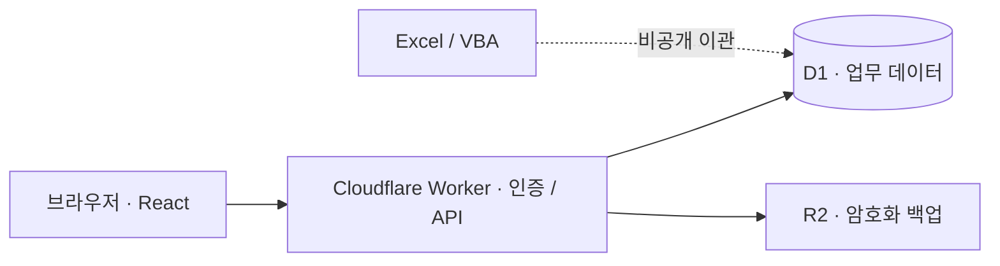

# 개발 안내

[서비스 소개](../README.md) · [문서 모음](README.md)

## 로컬 실행

**Node.js 24와 npm**을 권장합니다. 테스트는 `node:sqlite`와 `module.registerHooks`를 사용합니다.

```bash
git clone https://github.com/seopseopi/Jipjangbu.git
cd Jipjangbu
npm ci
```

[`.env.example`](../.env.example)을 참고해 Git에서 제외되는 로컬 `.env`를 만듭니다.

| 설정 | 용도 |
| :--- | :--- |
| `APP_ADMIN_USERNAME` | 개발 환경의 관리자 아이디 |
| `APP_ADMIN_PASSWORD_HASH` | 관리자 비밀번호의 PBKDF2 해시 |
| `APP_SESSION_SECRET` | 로그인 세션 서명 키 |
| `BACKUP_ENCRYPTION_KEY` | 백업 암호화 키 |

예시의 자리표시자는 실제 설정이 아니며, 설정하지 않으면 로그인할 수 없습니다. 비밀번호 해시 형식은 [`worker/security.ts`](../worker/security.ts)의 `verifyPassword`를 참고하세요. **개발용 키와 운영용 키는 분리**하고 실제 비밀번호·키를 코드나 이슈에 넣지 마세요.

```bash
npm run dev
```

서버가 출력하는 로컬 주소로 접속합니다. 로컬 실행은 별도의 D1·R2 에뮬레이터 저장소를 사용하며 운영 자료는 포함하지 않습니다. 개발과 검사에는 운영 비밀키나 실제 고객 자료가 필요하지 않습니다.

## 검사와 명령어

| 명령 | 역할 |
| :--- | :--- |
| `npm run dev` | 로컬 개발 서버 |
| `npm run lint` | 코드 규칙 검사 |
| `npm run typecheck` | TypeScript 타입 검사 |
| `npm test` | 타입 검사 → 빌드 → 회귀 테스트 |
| `npm run build` | 배포용 빌드 |
| `npm run db:generate` | 스키마 변경 후 마이그레이션 생성 |

[GitHub Actions](../.github/workflows/ci.yml)는 `main` 푸시와 PR에서 설치·코드 검사·타입 검사·빌드·테스트를 실행합니다. **운영 사이트를 자동 배포하거나 운영 DB를 변경하지 않습니다.** 최신 결과는 [CI 실행 목록](https://github.com/seopseopi/Jipjangbu/actions/workflows/ci.yml)에서 확인할 수 있습니다.

기능을 바꿀 때는 관련 회귀 테스트를 추가하고 `npm run lint`와 `npm test`를 실행하세요. 화면 동작을 확인할 때는 합성 자료를 사용하고, 재현 절차와 검증 범위를 변경 설명에 남겨 주세요.

## 시스템 구성



| 영역 | 구성 |
| :--- | :--- |
| 화면 | React 19 · TypeScript · Tailwind CSS 4 · Lucide |
| 실행·빌드 | vinext · Vite · Cloudflare Workers |
| 데이터 | Cloudflare D1 / SQLite · Drizzle 스키마·마이그레이션 · prepared SQL / batch |
| 인증 | 비밀번호 해시 검증 · 서명된 HttpOnly 세션 쿠키 · 로그인 시도 제한 |
| 백업 | Cloudflare R2 · AES-GCM 암호화 · 변경 전후 / 이용 시 일일 / 수동 백업 |
| 검증 | GitHub Actions · ESLint · TypeScript · Node.js 테스트 러너 |

## 코드 탐색

| 관심사 | 시작할 파일 |
| :--- | :--- |
| 화면 전환·초안·모달 | [`app/work-manager.tsx`](../app/work-manager.tsx) |
| 주소 검색·정렬 | [`app/api/_search.js`](../app/api/_search.js) · [`app/api/_ordering.ts`](../app/api/_ordering.ts) |
| 관계형 모델·매물 상태 | [`db/schema.ts`](../db/schema.ts) · [`db/listing-sync.ts`](../db/listing-sync.ts) |
| 읽기 캐시·요청 수명 | [`app/client-api.ts`](../app/client-api.ts) · [`db/bootstrap.ts`](../db/bootstrap.ts) |
| 삭제·복구 | [`app/api/trash`](../app/api/trash) · [`tests/deletion-safety.test.mjs`](../tests/deletion-safety.test.mjs) |
| 인증·암호화 백업 | [`worker/security.ts`](../worker/security.ts) · [`tests/runtime-performance.test.mjs`](../tests/runtime-performance.test.mjs) |

## 기존 엑셀 자료 이관

Excel에서 개발필요 파일을 `.xlsx`로 복사 저장한 뒤 [`scripts/build_private_import.py`](../scripts/build_private_import.py)로 비공개 마이그레이션을 만듭니다. 생성되는 `*_private_*.sql` 파일은 Git에서 제외됩니다. **원본 파일과 생성 결과를 공개 저장소에 넣지 마세요.**

시트별 역할, 중복 처리, 원문 보존 기준은 [엑셀 분석·이관 규칙](excel-analysis.md)을 먼저 확인하세요. 운영 자료를 다시 넣기 전에는 반드시 백업과 대상 환경을 확인해야 합니다.

## 운영 범위와 주의사항

- 변경 전 백업에 실패하면 데이터 변경을 중단합니다. 일일 백업은 사이트 이용 시 실행하며 접속과 무관하게 실행되는 예약 작업은 아닙니다. 자동 백업 보관 기간은 90일입니다.
- CSV는 화면별 내보내기이며 전체 관계를 복구하는 백업이 아닙니다. 내려받은 백업은 별도 안전한 장소에 보관하세요.
- 여러 기기에서 로그인할 수 있지만 일반 업무의 동시 편집 병합·잠금은 지원하지 않습니다. 나중 저장이 앞선 변경을 덮을 수 있습니다.
- 초안은 새로고침 후 자동 복구되지 않습니다. 할 일은 자동 문자·전화·푸시 알림을 보내지 않습니다.
- 운영 DB 전체 복원·재해 복구 훈련은 수행하지 않았습니다. 수정 전 버전 복원, 동시 편집 충돌 방지, 접속과 무관한 예약·외부 백업은 현재 완료된 기능이 아닙니다.

기능별 동작은 [사용 가이드](usage.md), 설계 판단과 검증의 한계는 [기술 사례](case-study.md)에 정리되어 있습니다.
